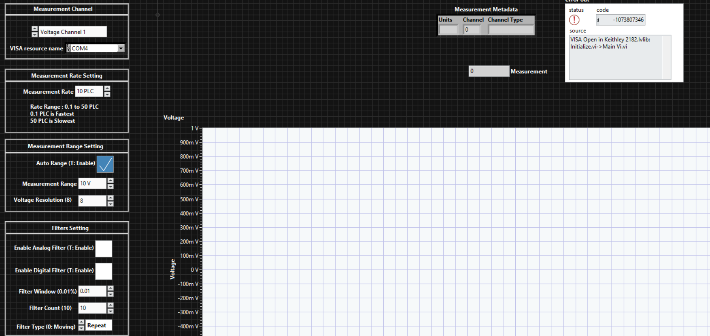

# Keithley 2182 Control System in LabVIEW

A LabVIEW application for full remote control of the Keithley 2182 Nanovoltmeter,
built for precise low-voltage measurements in research and test setups. It ran
continuously for two months without interruption, which is the part I'm most
proud of.

## Key features
- Configurable instrument settings: filter type, measurement interval, rate
  (NPLC), digital and analog filters, and reverse polarity mode
- Real-time data plotting on waveform charts and graphs
- Automatic data logging to CSV with timestamps and readings
- Clean GUI for easy operation and configuration
- Built for 24/7 stability with automatic error recovery

## Screenshots

**Front panel**

**Block diagram**

## How it works
The application communicates with the Keithley 2182 over  RS-232, sends
the configured measurement commands, and reads back voltage values. Readings are
plotted live and written to a timestamped CSV file for later analysis. An error
recovery routine catches communication dropouts and resumes the session, which is
what allowed the unattended two-month run.

## Built with
- LabVIEW 2021
- NI-VISA for instrument communication
- Keithley 2182 Drivers

## Skills demonstrated
LabVIEW, Instrument Control, GPIB, NI-VISA, Data Logging, Test Automation
